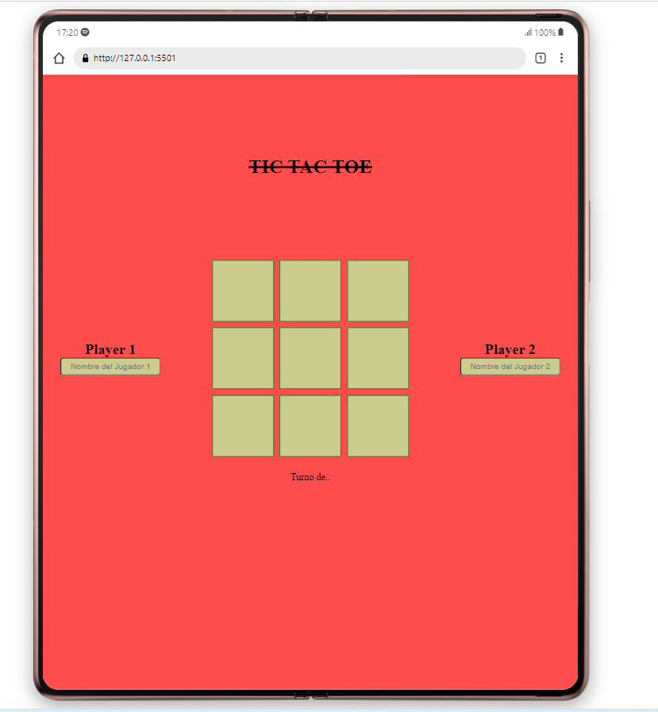

# Tic Tac Toe 


## About 

This project was carried out in order to finish the concepts of html and css and then implement JavaScript.

## Deploy
Using HTML and CSS 

## Getting Started 
To be able to play this game, all you need is an internet connection and a browser that can interpret Javascript

### Images


```
This image is how it is seen on tablet
```

```
This image is how it is seen on Notebook
```

```
This image is how it is seen on Mobile
```
<h2> Demo</h2>
Click <a href="https://franciscocampana1.github.io/Tic-Tac-Toe/">hear</a> for go to the demo. 

## Usage 

To use or modify the code can be done with a code editor, in this case we have used Visual Studio Code